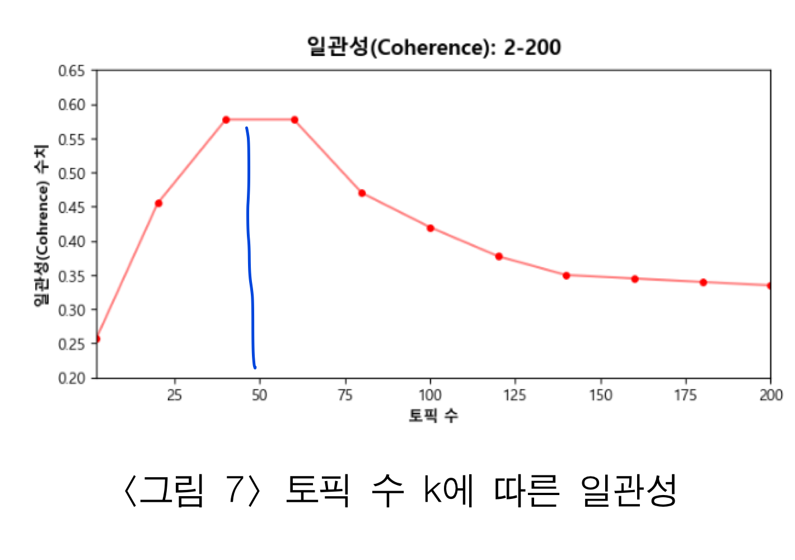
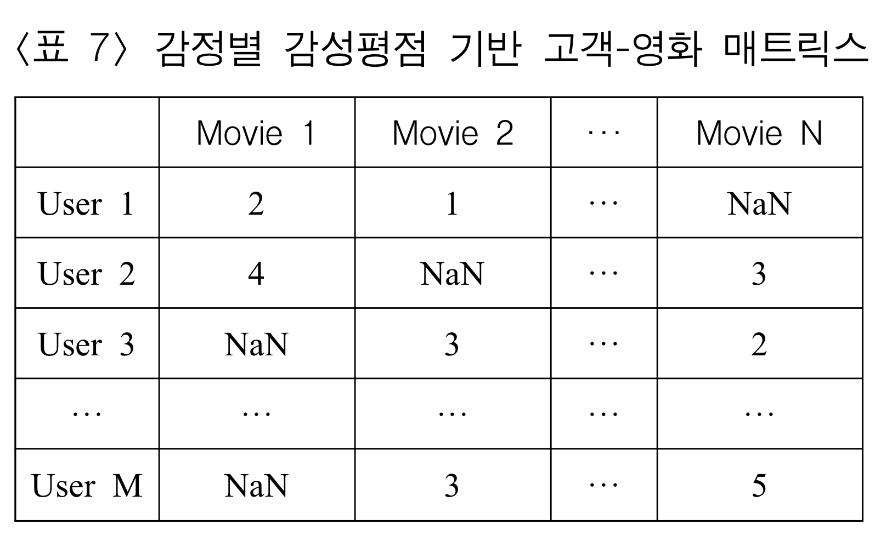
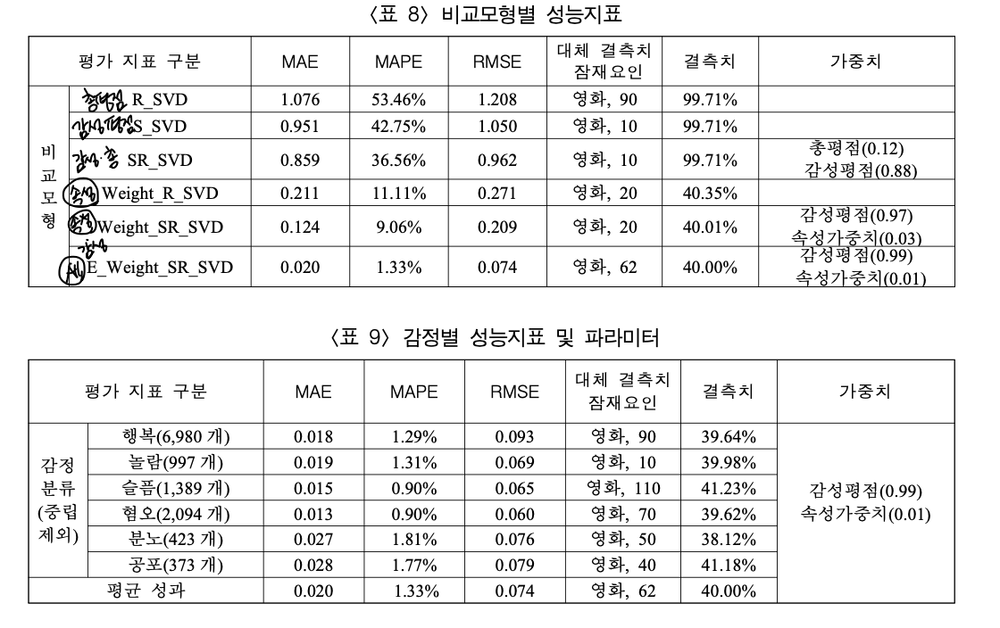

<!-- TOC -->

- [영화 리뷰의 상품속성과 고객 속성을 통합한 지능형 추천시스템 논문리뷰](#%EC%98%81%ED%99%94-%EB%A6%AC%EB%B7%B0%EC%9D%98-%EC%83%81%ED%92%88%EC%86%8D%EC%84%B1%EA%B3%BC-%EA%B3%A0%EA%B0%9D-%EC%86%8D%EC%84%B1%EC%9D%84-%ED%86%B5%ED%95%A9%ED%95%9C-%EC%A7%80%EB%8A%A5%ED%98%95-%EC%B6%94%EC%B2%9C%EC%8B%9C%EC%8A%A4%ED%85%9C-%EB%85%BC%EB%AC%B8%EB%A6%AC%EB%B7%B0)
    - [서론](#%EC%84%9C%EB%A1%A0)
    - [문헌 연구](#%EB%AC%B8%ED%97%8C-%EC%97%B0%EA%B5%AC)
        - [빅데이터 기반 추천 알고리즘](#%EB%B9%85%EB%8D%B0%EC%9D%B4%ED%84%B0-%EA%B8%B0%EB%B0%98-%EC%B6%94%EC%B2%9C-%EC%95%8C%EA%B3%A0%EB%A6%AC%EC%A6%98)
        - [온라인 리뷰 분석 기법과 응용](#%EC%98%A8%EB%9D%BC%EC%9D%B8-%EB%A6%AC%EB%B7%B0-%EB%B6%84%EC%84%9D-%EA%B8%B0%EB%B2%95%EA%B3%BC-%EC%9D%91%EC%9A%A9)
        - [상품과 고객 속성 기반 추천](#%EC%83%81%ED%92%88%EA%B3%BC-%EA%B3%A0%EA%B0%9D-%EC%86%8D%EC%84%B1-%EA%B8%B0%EB%B0%98-%EC%B6%94%EC%B2%9C)
    - [연구 프레임 워크](#%EC%97%B0%EA%B5%AC-%ED%94%84%EB%A0%88%EC%9E%84-%EC%9B%8C%ED%81%AC)
    - [실험 및 실험 결과](#%EC%8B%A4%ED%97%98-%EB%B0%8F-%EC%8B%A4%ED%97%98-%EA%B2%B0%EA%B3%BC)
        - [데이터 수집 및 전처리](#%EB%8D%B0%EC%9D%B4%ED%84%B0-%EC%88%98%EC%A7%91-%EB%B0%8F-%EC%A0%84%EC%B2%98%EB%A6%AC)
        - [영화 속성 추출](#%EC%98%81%ED%99%94-%EC%86%8D%EC%84%B1-%EC%B6%94%EC%B6%9C)
        - [감성 및 감정 분석](#%EA%B0%90%EC%84%B1-%EB%B0%8F-%EA%B0%90%EC%A0%95-%EB%B6%84%EC%84%9D)
        - [데이터 표본 추출](#%EB%8D%B0%EC%9D%B4%ED%84%B0-%ED%91%9C%EB%B3%B8-%EC%B6%94%EC%B6%9C)
        - [감정별 개인화 추천 시스템](#%EA%B0%90%EC%A0%95%EB%B3%84-%EA%B0%9C%EC%9D%B8%ED%99%94-%EC%B6%94%EC%B2%9C-%EC%8B%9C%EC%8A%A4%ED%85%9C)
        - [분석결과](#%EB%B6%84%EC%84%9D%EA%B2%B0%EA%B3%BC)
    - [결과 분석 및 토론](#%EA%B2%B0%EA%B3%BC-%EB%B6%84%EC%84%9D-%EB%B0%8F-%ED%86%A0%EB%A1%A0)
    - [결론 및 향후 연구 방향](#%EA%B2%B0%EB%A1%A0-%EB%B0%8F-%ED%96%A5%ED%9B%84-%EC%97%B0%EA%B5%AC-%EB%B0%A9%ED%96%A5)

<!-- /TOC -->
# 영화 리뷰의 상품속성과 고객 속성을 통합한 지능형 추천시스템 논문리뷰

이번주는 추천 시스템 프로젝트의 전반적인 프로세스 및 개념을 공부하기
위하여 논문리뷰를 진행하였다. 이를 통하여 추천시스템을 직접적으로
경험하고 프로젝트 진행 시 알아야하는 워크 플로우를 체화할 수 있을 것으로
기대한다.

논문리뷰 방식은 다음과 같다.

1.  각자 해당 논문을 읽어오고 노션에 정리해오기

2.  룰렛을 돌려가며 두 단락씩 팀원들 앞에서 발표

3.  발표가 끝나면 나머지 팀원은 자신의 의견, 이해한 방식 덧붙이기 등의
    토의 진행

4.  토의 후에도 해결하지 못한 질문은 추가로 리서치

------------------------------------------------------------------------

 

## 1. 서론

온라인 리뷰는 고객의 잠재적 니즈를 담고 있어 고객 관리 및 확장을 위한
필수적 요소이며 고객의 의견을 쉽게 파악할 수 있다는 장점을 가짐.

그러나 기존 추천 시스템은 상품 속성 및 고객 속성에 대한 선호도를
반영하지 못하고 있기 때문에 상품과 고객의 특성을 고려한 개인화 추천
시스템이 필요함.

최근 연구에서는 리뷰 데이터를 감성분석 및 가중치 측정을 통해 정량화 하여
총평점 기반의 고객-상품 매트릭스와 결합한 추천 모형을 제안하는 연구들이
있었다. 이렇듯 정성적 데이터를 기반으로한 추천 모형은 기존의 총평점
기반의 모형보다 더 높은 정확성을 보여줬음.

본 연구에서는 영화리뷰 데이터를 대상으로 LDA를 이용하여 상품속성과 고객
속성을 총평점 데이터와 통합하여 추천시스템을 제안함.

------------------------------------------------------------------------

 

## 2. 문헌 연구

### 2.1 빅데이터 기반 추천 알고리즘

추천시스템 이란 과거의 고객 데이터를 기반으로 고객이 관심있을 것 으로
예상되는 상품을 추천하는 기법을 이야기함.

**협업 필터링(Collaborative Filtering)** 은 아이템에 대한 선호도가
비슷한 고객들은 다른 아이템에 대한 선호도 또한 유사할 것이라는 가정을
기반으로 아이템간 혹은 고객 간 유사도를 측정하고 선호도를 예측함.

-   **메모리 기반 방식 (=이웃모형)**

    :   매트릭스(=데이터 =메모리) 를 구축하고 매트릭스의 고객 및
        아이템을 이용하여 유사한 고객 및 아이템을 찾아 예상 평점을
        추론하는 방식

    -   **고객기반 협업 필터링**

        :   고객이 남긴 선호도 정보사용. (고객 유사도 중심) 고객 1 이
            아이템 135를 선호하고, 고객2가 아이템 1357을 선호하며 고객1,
            2가 서로 유사한 고객이라면 고객1에게 아이템 7을 추천

        음악, 친구 추천에 사용

    -   **아이템 기반 협업 필터링**

        :   아이템을 선호하는 고객정보 사용 (아이템 유사도 중심) 고객
            1357이 아이템 1을 선호하고 아이템 1과 아이템4가 서로 유사해
            고객 135가 아이템 4를 선택한다면 고객 7에게 아이템 4를 추천

        영상 플랫폼 콘텐츠 추천에 사용

-   **모델기반 방식**

    :   메모리 기반 방식이 가지고 있는 데이터 희소성, 일관성 없는
        사용자에 대한 문제점을 보완하는 방식. 평점데이터를 기반으로
        모델링하기 때문에 실제로 평점을 제공하지 않아도 평점 예측 가능

    -   **MF (Matrix Factorization)**

        :   고객과 아이템 간의 잠재적 요인을 파악하여 평점 예측

        -   SVD 알고리즘 (특잇값 분해)

            $$
              M = U \Sigma V^t
              $$

            U : 고객행렬 , $\Sigma$ : 특잇값 , V : 아이템 행렬

    -   **기계학습 방법**

        :   고객과 상품간의 비선형적인 복잡한 관계를 학습하여 관계를
            추론하는 방식

        인공신경망, 의사결정나무, SVM기법 존재

### 2.2 온라인 리뷰 분석 기법과 응용

온라인 리뷰란 특정 재화나 서비스에 대한 소비자 개인의 평가와 경험을
의미함. 또한 재화나 서비스에 대한 정보 뿐만 아니라 사용자의 사용 경험과
추천 여부의 성격도 포함

⇒ 구매를 앞둔 소비자에게 유용한 정보로 사용 가능

**[소개된 온라인 리뷰 분석 기법]**

어휘기반 (lexicon-based) 감성분석 모델 제안

LDA 기반의 통계적 모델 제안

LSTM과 CNN 결합한 아키텍처 구축 → 감성지수를 분류하는 모델 제안

어휘기반 & 기계학습 기반 방법이 결합한 하이브리드 방법론 연구

BERT 기반의 감성 분석을 적용한 모델 제안

### 2.3 상품과 고객 속성 기반 추천

온라인 리뷰는 고객의 경험을 기반으로 생성 → 긍정 or 부정 등의 의견이
표현됨

영화는 경험재 기반 산업. 즉 영화 시청 전 고객들은 영화의 속성 및
주변정보에 의존하여 영화 선택. 영화를 시청한 고객의 리뷰는 영화 선택에
영향을 미침

**[영화의 속성]**

1.  핵심적 속성 : 배우, 스토리등의 내용과 직접적인 요소
2.  주변적 속성 : 세트, 의상 등의 전반적인 흐름과 관련된 요소
3.  정서적 속성 : 영화시청을 통해 관객이 느끼는 감정과 관련된 요소

위 속성을 기반으로 영화 리뷰를 분석하겠다고 논문에서 이야기하고 있음

------------------------------------------------------------------------

 

## 3. 연구 프레임 워크

협업 필터링의 모델기반 방법 사용

1.  **데이터 수집**

    1.  국내외 영화 대상, 한국어로 작성된 온라인 영화리뷰 데이터 수집

2.  **텍스트 마이닝을 통한 상품속성 및 고객속성 추출**

    1.  LDA를 이용하여 토픽 추출. 리뷰별로 속성 가중치 측정 → 리뷰별
        속성 가중치 DB 구축
    2.  감성사전 활용 어휘기반 감성분석 진행. 긍정, 중립, 부정으로 분류
        → 리뷰별 감성 점수 DB 구축
    3.  KoBERT를 사용하여 감정분석 진행. 기쁨, 슬픔, 놀람, 분노, 혐오,
        중립 으로 분류 → 리뷰별 감정 분류 DB 구축

    추가로 추천시스템이 가지는 고질적인 문제인 데이터 희소성 문제를
    예방하기 위해 최소한의 리뷰수를 갖는 고객을 대상으로 데이터 추출

3.  **감정별 속성 가중치를 반영한 감성 및 총평점 만들기**

    1.  속성 가중치를 반영한 총평점 기반 고객-영화 매트릭스 =
        ${(고객속성\ 가중치 행렬)}^T$ $(영화속성 \ 가중치행렬)$

    2.  고객-영화 매트릭스 생성

        :   감정별 감성 평점 생성 → 두 평점에 최적의 가중치 지점 찾기 →
            감정별 속성 가중치를 반영한 감성 및 총평점 만들기 ⇒
            고객-영화 매트릭스 생성

------------------------------------------------------------------------
 

## 4. 실험 및 실험 결과

### 4.1 데이터 수집 및 전처리

2022.2.14 \~ 2022.5.1까지의 네이버 영화리뷰를 python 웹스크래퍼를 사용해
수집

10점 만점의 평점을 5점만점으로 범주 조정화 진행함.

리뷰데이터는 웹사이트 링크, 특수문자, 이모티콘, 공백, 숫자및영어,
결측치, 불용어를 제거하여 사용함.(RNAKNL에서 제공하는 한국어 불용어 사전
사용)

### 4.2 영화 속성 추출

(각 리뷰가 어떤 영화속성을 가지고 있는지 파악하기 위해 속성을 대표하는
키워드를 선정하는 단계)

토픽 모델링의 LDA 적용 → 3가지 속성에 매칭되는 대표 키워드 선정

최적의 토픽수 k (하이퍼 파라미터)를 결정하기위해 k fold cross validation
으로 하이퍼 파라미터 튜닝 진행.

이때 일관성(coherence)와 혼잡도(perplexity)를 기준으로 최적의 하이퍼
파라미터 결정

-   일관성 : 토픽별 단어가 의미론적으로 유사한가 ➡️ 높을 수록 좋음
-   혼잡도 : 모델이 실제로 관측되는 값을 얼마나 잘 예측하는가 ➡️ 낮을
    수록 좋음

 

2≤k≤200 범위에서 k = 50을 최적의 토픽수로 결정

➡️ 결과 :

### 4.3 감성 및 감정 분석

1.  어휘기반 감성분석 (긍정, 중립,부정으로 분류)

    KNU 사전 활용 → 리뷰 토큰화 → 명사, 형용사, 동사 추출 ⇒ 리뷰별 감성
    점수 및 감성극성 측정

    감성 점수별 데이터 수가 적은 양 극단치 제거 & 군집분석을 통해
    감성평점을 5개의 범주로 범주화

    (각 리뷰가 얼마나 긍정적인지 (부정적인지)에 대한 척도 마련)

2.  리뷰별 감정 분류

    KoBERT 활용 하여 7개의 감정으로 분류. AI Hub에서 제공하는 '한국어
    단발성 대화' 데이터를 기반으로 모델 학습 후 이를 적용함.

    (각 리뷰가 어떤 감정을 가지고 있는지 (기쁨, 슬픔, 놀람, 분노, 혐오,
    중립)에 대한 정보 마련)

### 4.4 데이터 표본 추출

데이터 희소성 문제를 줄이기 위해 한 고객이 10개 이하의 리뷰를 사용했다면
해당 고객을 제거

총평점 (별점)과 감성평점의 긍정과 부정의 리뷰 의미가 서로 다른 데이터
제거

ex. 별점은 5점인데 감성평점에서 부정으로 나온 리뷰는 제거

### 4.5 감정별 개인화 추천 시스템

1.  **속성 가중치를 반영한 총평점 기반 고객 영화 매트릭스**

    고객.영화 매트릭스 = ${(고객속성\ 가중치 행렬)}^T$
    $(영화속성 \ 가중치행렬)$

    

    (이때, LDA를 이용해서 영화 속성 추출한 키워드를 count한다.)

    1.  **고객 속성 가중치 행렬**

        고객이 영화를 평가할 때 어떤 특성을 우선순위로 고려하는가에 대한
        행렬

        ex) 고객1이 남긴 여러 영화에 대한 리뷰들이 어떤 속성 (핵심,주변,
        감성)을 중요하게 생각하는지를 가중치로 만든 matrix

        -   고객 가중치 점수

            $$
              X_{ij} = \frac{8}{1+e^{z_{ij}}} -3 
              $$

            $z_{ij}$ : 고객 $u_{ij}$가 feature $F_j$(영화특성 :
            핵심,주변,정서)에 대해 언급한 횟수

            \*이때 언급한 횟수는 4.2 에서 뽑은 속성별 대표 단어를 count
            하는 듯

            이후 한 리뷰어의 가중치 합이 1이되도록 변환

        

    2.  **상품 속성 가중치 행렬**

        세부 속성에 대해 평균적으로 몇점으로 평가 되고 있는지를 나타냄

        ex) 영화 1을 볼때 사람들은 어떤 속성을 (핵심,주변, 감성)을
        중요하게 생각하는지를 가중치로 만든 matrix

        -   상품 속성 총평점

            $$
              Y_{ij} = \frac{2}{1+e^{-k*s_i}} +1
              $$

            k : 영화 pi의 속성들 중에서 $F_j$(영화특성 :
            핵심,주변,정서)에 대한 리뷰의 수 $s_i$ : $F_j$에 대한 평균
            총평점 (ex. 핵심 특성에 대한 리뷰들의 평균 총평점)

            이후 한 영화의 가중치 합이 5이 되도록 변환

            (한 영화를 리뷰한 리뷰가 어떤 속성을 가지고 있는지 속성별
            비율 & 해당 속성의 별점 평균 반영)

            

2.  **감정별 감성평점 기반 고객-영화 매트릭스**

    '5점 척도의 감성평점 (긍정, 부정) 변수' , '6가지의 감정 변수 (슬픔,
    기쁨 ,,,)' 를 기반으로 감정별 감성 평점 기반 고객-영화 매트릭스 생성

    

    (감성분석결과, 감정분석 결과를 기반으로 만든 matrix)

3.  **가중치 측정**

    표 4, 표 7의 매트릭스 평점을 하나의 평점으로 만들기 위해 각 평점별
    최적의 가중치 지점을 찾음.

    <표4> : 고객 속성 가중치 행렬 <표7> : 감정별 감성 평점 기반
    고객-영화 매트릭스

    (아래 notation은 리뷰를 진행하면서 임의로 작성한 것) 
    $$
     w_1 \cdot 표4 + w_2 \cdot표7 , \\( 단 , \ w_1+w_2 = 1)
     $$

    $w_1$, $w_2$를 0.01 단위로 바꾸어 가며 99번의 RMSE 측정.

    이때 최소 RMSE를 갖는 가중치는 $w_1=0.01$, $w_2 = 0.99$.

### 4.6 분석결과

6개 모델을 구축하여 비교

-   R_SVD : 총평점 (별점) 기반
-   S_SVD : 감성평점 (표7) 기반
-   SR_SVD : 감성 & 총평점 기반
-   Weight_R\_SVD : 속성가중치 (표4) 총평점
-   Weight_SR_SVD : 속성 가중치 & 감성평점 & 총평점
-   E_Weight_SR_SVD : 감정 별 속성가중치 기반 감성 및 총평점

SVD 적용하며, 결측치는 각 연구 모형 별 가중치 측정을 통해 영화 평점의
평균으로 결측치 대체

최적의 잠재요인 k 를 측정하기 위해 10\~160까지의 잠재요인을 설정 하여
최적의 k 도출

평가 지표로 RMSE, MAE, MAPE 사용

그 결과 E_Weight_SR_SVD 모델의 RMSE 가 0.074로 가장 우수한 성과를
보여줌. 또한 속성 가중치(표4)를 반영한 총평점을 적용한 모형들의 결측치가
약 40%로 낮아져 데이터 희소성 문제를 해결함.

------------------------------------------------------------------------

 

## 5. 결과 분석 및 토론

속성의 가중치를 반영하여 모형 구축함으로써 데이터 희소성 해결.

정성적인 데이터인 리뷰에 토픽모델링, 감성 및 감정 분석을 적용하여 우수한
성과 도출

[본 연구의 학술적 시사점]

1.  **메모리 기반의 데이터 희소성 문제 해결**

    모델 기반 모형의 SVD 알고리즘과 정량적 데이터 (별점)와 정성적 데이터
    (리뷰)를 결합하여 이를 해결

2.  **최적의 가중치 지점을 측정하는 프로세스 구축**

    속성 가중치를 반영한 총평점 기반의 매트릭스를 하나의 고객-영화 평점
    매트릭스로 생성하기 위해 , 평점별 최적의 가중치 지점을 측정하는
    프로세스 구축

3.  **정량적 데이터와 정성적 데이터의 통합 모형**

    정량적 데이터인 총평점과 정성적 데이터인 리뷰를 영화속성, 감성점수,
    감정분류를 이용하여 하나의 통합 모형 제안

[본 연구의 실무적 시사점]

1.  **정량적인 데이터를 사용하는 기존 추천 모형의 발전**

    기존 추천 모형은 총평점과 같은 정량적인 데이터를 이용하여 추천을
    진행하였지만 본 연구에서는 데이터 마이닝의 토픽모델링, 감성 및
    감정분석을 적용한 방법론을 제시함.

2.  다양한 자료 원천을 대상으로 추천시스템을 개발할 수 있는 방법론 제시

3.  메모리 기반 모형의 한계점을 극복하기 위해 모델 기반 모형의
    알고리즘을 활용한 추천 모형 제안

    과거의 데이터가 충분하지 않은 신규 고객에게도 적용가능. 새로운
    아이템에 대해서도 적용가능.

4.  한국어 기반의 텍스트 마이닝 연구의 발전에 기여

------------------------------------------------------------------------
 

## 6. 결론 및 향후 연구 방향

**[한계 및 향후 연구 방향]**

1.  리뷰를 10개 이하로 작성한 고객의 제외

    신규고객의경우 10개 이상의 리뷰 데이터를 제공하지 못 할 가능성이
    크며, 10개 이하의 리뷰를 제공한 고객이어도 중요한 정보를 제공할 수
    있으므로 향후 다양한 고객의 의견을 반영할 수 있는 방법 모색 필요

2.  특수문자 & 이모티콘 제거 및 명사,형용사, 동사만 추출한 문제

    어휘기반의 감성분석을 위해 리뷰데이터를 가공하였음. 햐후 연구에서는
    대명사, 부사 등 다양한 품사를 활용하고 특수문자와 이모티콘을 추천
    모형에 반영하는 것 필요.

3.  SVD 알고리즘 적용

    본 연구에서는 SVD 알고리즘을 적용하였으나 딥러닝 기반의 추천
    알고리즘을 적용하여 보다 우수한 성과 도출을 기대함
