# '딥러닝 모델을 이용한 실시간 대학 교양 강의 추천 시스템' 논문리뷰

이번주는 앞으로 진행할 추천 시스템 심화 프로젝트와 유사한 주제의 논문을 리뷰하면서 구체적인 계획을 세우기 위하여 논문리뷰를 진행하였다. 이를 통하여 추천시스템을 직접적으로
경험하고 프로젝트 진행 시 알아야하는 워크 플로우를 체화할 수 있을 것으로
기대한다.

논문리뷰 방식은 다음과 같다.

1.  각자 해당 논문을 읽어오고 노션에 정리해오기

2.  룰렛을 돌려가며 두 단락씩 팀원들 앞에서 발표

3.  발표가 끝나면 나머지 팀원은 자신의 의견, 이해한 방식 덧붙이기 등의
    토의 진행

4.  토의 후에도 해결하지 못한 질문은 추가로 리서치

------------------------------------------------------------------------
  

# 목차

<!-- TOC -->

- ['딥러닝 모델을 이용한 실시간 대학 교양 강의 추천 시스템' 논문리뷰](#딥러닝-모델을-이용한-실시간-대학-교양-강의-추천-시스템-논문리뷰)
- [목차](#목차)
- [1. 서론](#1-서론)
- [2. 관련 연구](#2-관련-연구)
  - [2.1. Collaborative Filtering](#21-collaborative-filtering)
    - [Feature Embeddings :](#feature-embeddings-)
  - [2.2. Convolutional Neural Network](#22-convolutional-neural-network)
  - [2.3. Factorization Machines](#23-factorization-machines)
  - [2.4. Attention based pooling layer](#24-attention-based-pooling-layer)
  - [2.5. Attentional Factorization Machine](#25-attentional-factorization-machine)
- [3. 이전 연구](#3-이전-연구)
- [4. 방법론](#4-방법론)
  - [4-1. Embedding, Factorization Machine \& Attention-based Pooling Layer](#4-1-embedding-factorization-machine--attention-based-pooling-layer)
  - [4-2. Convolutional Neural Network Block](#4-2-convolutional-neural-network-block)
- [5. 데이터 구성](#5-데이터-구성)
- [6. 실험 결과](#6-실험-결과)
- [7. 결론 및 활용방안](#7-결론-및-활용방안)

<!-- /TOC -->
 

# 1. 서론

교양 과목을 선택하는 방법 중 사람들이 선호하는 방법은 선배들이 어떤 과목을 들었는가 임. 이러한 사실을 반영하기 위해 사용자의 학과를 파악하고 학과 별로 선배들의 데이터를 참고하여 예측에 반영할 수 있도록 함.

추천시스템은 지속적으로 발생하는 개인의 로그를 사용하여 상품을 예측하고 추천함. 이를 위해 로그에 기록되는 각 feature들 사이의 관계성을 유추하는 것에 집중함. 

BUT 본 연구에서 기존의 연구의 방법론들을 적용했을 때, under fitting 현상이 발생. → 이는 데이터가 예측 결과를 제대로 표현하고 있지 못해서 발생한 것이라고 판단. 

⇒ 부족한 데이터의 표현력을 확장 하고 feature간 관계성을 유추하기 위해 CNN방법론을 적용한 Convolutional Factorization Machines with Attention (CFMA) 제안

본 연구에서는 추천 시스템에서 사용하는 user-item matrix 대신 user와 item의 정보가 함께 포함되어있는 메타데이터를 사용함. 즉 user와 item의 정보(X)를 통하여 점수(Y)를 예측하여 추천시스템에 활용함. 이때 딥러닝 기법을 이용하여 점수를 예측함. 해당 메타 데이터에는 강의의 정보, 학생의 정보, 교수의 정보를 포함하고 있음.

# 2. 관련 연구

## 2.1. Collaborative Filtering

협업 필터링에서 사용하는 데이터는 보통 [사용자, 아이템, 점수]를 이용하여 matrix를 구성함. 구성된 matrix에서 사용자간 유사도를 계산하여 유사한 이웃 k명을 추출함. 이때 유사도는 cosine similarity 를 사용.

$$
pred(a,p) = \bar r_a + \frac{\Sigma_{b \in N}sim(a,b) * (r_{b,p}-\bar{r_b})}{\Sigma_{b \in N}sim(a,b)}
$$

a, b : 사용자, p : 아이템

$\bar{r_a}$ : 사용자 a가 남긴 평균 평점

N : 설정한 이웃 수 

$r_{b,p}$ : b가 p를 사용하고난 후 남긴 평점 

$\bar{r_b}$ : b가 남긴 평점의 평균

$sim(a,b)$ : a,b의 유사도

### Feature Embeddings :

범주형 변수의 embedding

범주형 변수는 그대로 모델에 삽입되기 어렵기 때문에 임베딩하는 과정이 필요한데, 이때 범주형 변수는 sparse하고 높은 차원으로 표현 되기 때문에 일반적으로 저차원 잠재공간의 밀집도 높은 벡터에 임베딩함. 

$$
x = [x_1, ...,x_m] \\ e_i = V_i * x_i
$$

이때 $x_i$는 i번째 feature space (one hot encoding 형태) , V_i는 i번째 embedding matrix

예를 들어서 변수 x가 feature를 [고양이, 토끼, 강아지]를 갖는다고 하면 $x_1$ = 고양이 인듯..?

## 2.2. Convolutional Neural Network

CNN은 filter를 사용하여 이미지의 특징을 추출하여 정보를 축약할 수 있음. 이 연구에서는 자연어 처리에서 사용하는 1D CNN사용

- **CNN 에 관하여**
    
    [[딥러닝 모델] CNN (Convolutional Neural Network) 설명](https://rubber-tree.tistory.com/entry/딥러닝-모델-CNN-Convolutional-Neural-Network-설명)
    
    CNN은 크게 2가지 레이어로 나뉨
    
    - **Convolution/Pooling** 메커니즘은 이미지를 형상으로 분할하고 분석.
    - **FC(Fully Connected Layer)** 로, 이미지를 분류/설명하는 데 가장 적합하게 예측.

## 2.3. Factorization Machines

추천 시스템에서 사용하는 데이터는 [사용자, 아이템, 점수] 로 이루어진 데이터를 사용하지만 현실에서 사용하는 데이터는 보통 다양한 메타 데이터를 포함하고 있음. 일반적으로 정보를 많이 사용하여 예측하는 것이 좋다고 알려져 있기 때문에 메타 데이터를 이용하여 아이템을 추천하도록 함. 

→ click-Through Rate(CTR:클릭률)분야에서 연구된 모델을 참조. 

고차원 데이터에 대한 2차 특성 상호작용을 명시적으로 모델링하기 위해 Factorization Machine을 제안. 일반적인 FM예측은 다음과 같음.

$$
\hat y = w_0 + \Sigma^n_{i=1} w_ix_i + \Sigma^n_{i=1} \Sigma^n_{j=i+1} (\vec v_i \cdot \vec v_j) x_i x_j
$$

- ### **Matrix Factorization**
    
    [[추천 시스템] Matrix factorization](https://blog.naver.com/PostView.naver?blogId=shino1025&logNo=222394488801)
    
    Matrix Factorization (MF)란 user과 item 간의 평가 정보를 나타내는 Rating matrix를 User Latent matrix와 Item Latant matrix로 분해하는 기법을 이야기함.
    
    rating matrix는 (user수) * (item 수)로 이루어진 행렬임. 각 칸에는 각 유저가 해당 아이템에 대한 평가 수치가 기록되어 있음. 그러나 이 matrix는 비어있는 부분이 많음(sparse한 matrix). MF는 행렬 분해 과정에서 이러한 빈칸을 채울만한 평점을 예측 하는 과정이라고 생각하면 됨.
    
    Rating matrix는 MF를 통해 2개의 행렬로 나누어지는데, 각 행렬의 형태는 다음과 같음.
    
    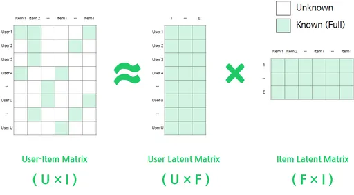
    
    - User Latent matrix (U) = (User의 수 ) * K
    - Item Latent matrix (I) = (Item의 수 ) * K
    - Rating Matrix(R) = (User * K) X (K *Item) ⇒ User * Item
    
    user latent matrix 혹은 item latent matrix를 전치 하여 행렬곱 연산을 하면 기존의  rating matrix로 돌아옴.
    
     
    
    Latent matrix는 각 유저와 아이템에 대하여 그 수 만큼 row를 갖고 K개만큼의 공간을 할당 받음. 이때 K는 Latent Factor의 크기로 Hyper parameter로 입력받음. 즉, K는 유저 및 아이템에 대한 정보를 저장하는 공간으로, K를 크게 잡으면 기존의 rating matrix로 부터 다양한 정보를 가져갈 수 있지만, K를 작게 잡아야만 핵심적인 정보와 노이즈를 제거할 수 있음.
    → 얼만큼의 Latent Factor 크기를 할당하냐에 따라 설명력이 낮은 정보를 삭제하고 설명이 높은 정보를 남긴다는 방향성으로 matrix가 형성되게 됨.
    
    (SVD알고리즘은 latent matrix로 행렬을 분해 시키는 알고리즘 중 하나임, SVD이외에도 행렬을 latent matrix로 분해하고 임의의 K를 할당한 뒤에 Gradient decent 방식으로 K를 찾아내는 방법도 있음.)
    
- ### **Factorization Machines (FM)**
    
    [Factorization Machines](https://velog.io/@rlawhddn1010/Factorization-Machines)
    
    Matrix Factorization 방법은 user, item, rating 만 사용하지만 Factorization Machines 방법은 더 다양한 feature를 사용할 수 있음. 
    
    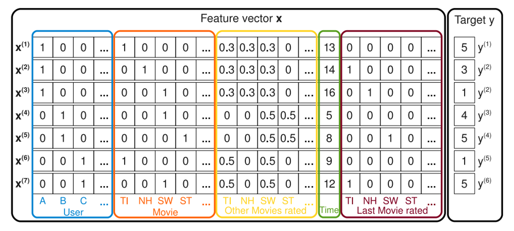
    
    
    
    |U| : user, |I| : item, |T| : time ,,등등의 feature를 다양하게 사용한 xi를 이용하여  target value인 yi를 예측함. 이때 타겟 value는 평점 데이터이며 궁극적으로 피쳐 엔지니어링을 한 추가 정보들을 하나의 특성 벡터로 합쳐 최종 rating 을 예측함.
    
    - **선형 회귀 방식**
        
        
        
        각 변수에 가중치를 부여하여 선형 회귀 방식으로 예측하는 방법. 계산은 빠르지만 각 변수 간의 interaction 반영이 되지 않는다는 문제점이 있어 다음과 같은 식 제안.
        
        
        
        서로 다른 변수 간의 interaction에 가중치를 부여 
        
        이때 예측해야 하는 파라미터는 $W_0$ (Global Bias), $W_i$ (i번째 weight), $W_{ij}$ : i,j의 interaction weight
        
        빨간 박스 부분이 추가 됨으로써 변수 간 interaction을 표현할 수 있음. 이는 다항 회귀와 매우 흡사하지만 FM은 interaction 항의 계수를 coefficient 대신 변수간의 Latent Vector의 내적으로 사용한다는 차이가 있음. 
        
        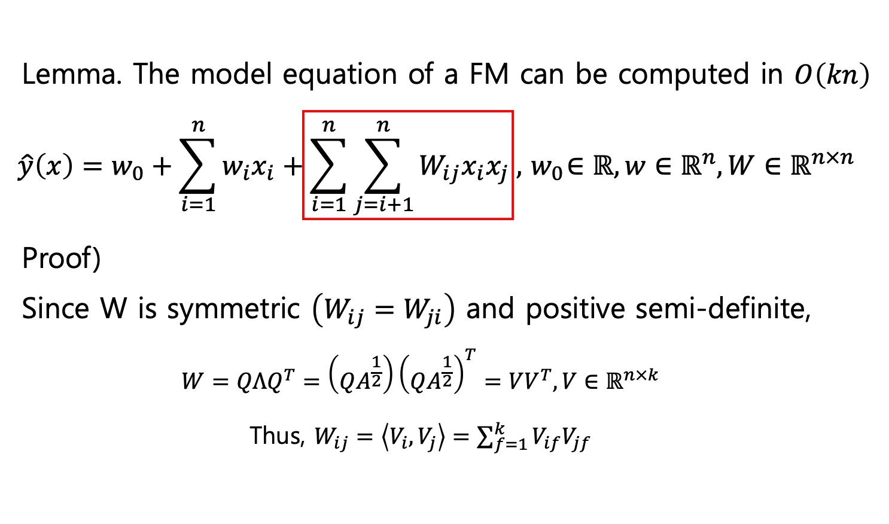
        
        이때, $W_{ij} =W_{ji}$로 symmetric하고 양정치 행렬이므로 위와 같이 분해 가능하므로 아래와 같이 나타낼 수 있음. 
        
        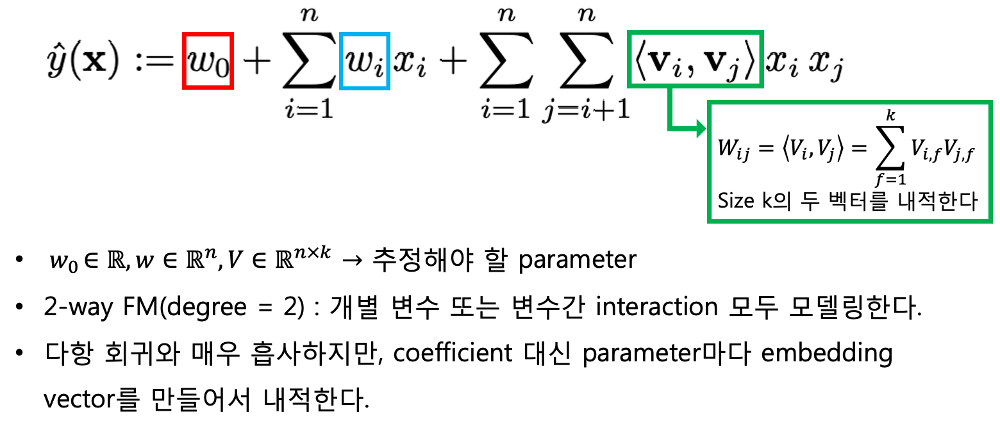
        
        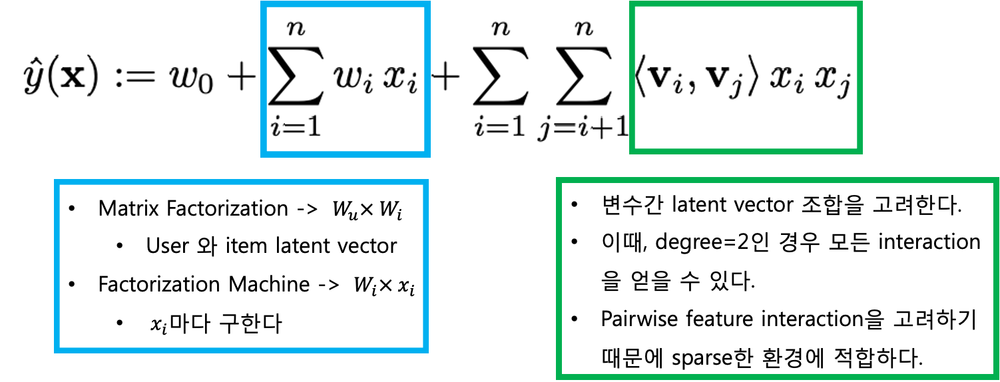
        

## 2.4. Attention based pooling layer

어텐션 기법중 가장 기본적인 attention based pooling layer 사용.

이를 통해 FM에서 찾는 feature간 interaction을 명시적으로 모델링하는 것과 동시에 attention 기법을 적용하여 어떤 interaction이 더 많은 영향을 미치는가를 알 수 있게 됨.

## 2.5. Attentional Factorization Machine

FM은 feature간의 interaction을 추정하여 좋은 결과를 낼 수 있도록 하는 알고리즘임. 기존 방법으론은 모든 interaction term의 weight를 같게 하여 학습하므로 비효율적임 → 이를 해결하기 위해 interaction 별로 가중치를 다르게 하는 attention 기법을 추가한 연구 사용

- ### **Attentional Factorization Machine**
    
    [Python, Machine & Deep Learning](https://greeksharifa.github.io/machine_learning/2020/05/01/AFM/)
    
    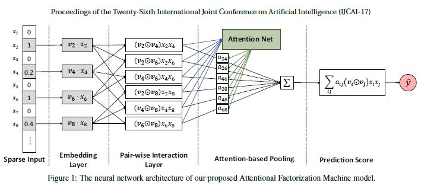
    
    Attentional Factorization Machine (AFM)의 전체적인 구조
    
    그림에서는 선형 회귀 부분은 생략. input layer와 embedding layer의 경우 FM과 같은 구조임. Input feature는 sparse하게 이루어져 있고 이들은 dense vector로 임베딩 됨.
    
    - **Pair-wise interaction Layer**
        
        상호작용을 포착하기 위해 내적을 사용하는 FM을 참고하여, 본 논문에서는 신경망 모델링에서 새로운 `pair-wise Interaction Layer` 를 제시. m 개의 벡터를 $\frac{m(m-1)}{2}$개의 interaction vector로 만드는데, 이때 interacted vector는 상호작용을 포착하기 위해 2개의 다른 벡터들의 원소 곱으로 계산됨.
        
        즉, pair-wise interaction layer의 결과물은 아래와 같은 벡터의 집합으로 표현할 수 있고, 
        
        $$
        f_{PI}(\epsilon) = \{ (v_i \odot v_j) x_i x_j \}_{(i, j \in R_x)}
        $$
        
        이를 sum pooling으로 압축한다음 Fully connected Layer을 사용하여 prediction score에 project한다.
        
        $$
        \hat{y} = p^T \sum_{(i, j) \in R_x} (v_i \odot v_j) x_i x_j + b
        $$
        
        여기서 p,b 는 prediction layer weight와 bias
        
    - **Attention-based Pooling layer**
        
        interaction vector들의 가중합을 수행하여 피처 상호작용에 대해서 attention 메커니즘 적용
        
        $$
        f_{Att}(f_{PI}(\epsilon)) = a_{i,j} \sum_{(i, j) \in R_x} (v_i \odot v_j) x_i x_j
        $$
        
        여기서 $a_{i,j}$는 피처 상호작용 $\hat{w_{ij}}$의 Attention score
        
        $$
        e_{ij} = h^T ReLU(W (v_i \odot v_j) x_i x_j + b)
        $$
        
        $$
        a_{ij} = \frac {exp(e_{ij})} { \sum_{(i, j) \in R_x} exp(e_{ij}) }
        $$
        
        - $W \in R^{t*k}, b \in R^t, h \in R^t$
        - t : Attention Network의 hidden layer의 크기 (Attention Factor)
        
        Attention Score는 softmax 함수를 통해 정규화 되고, 이 Attention-based Pooling layer의 결과물은 k차원의 벡터로, 중요성을 구별하여 임베딩 공간에서의 모든 피쳐 상호작용을 압축한 것임.
        
        결론적으로 AFM 모델의 최종 공식은 다음과 같음.
        
        $$
        \hat{y}_{AFM}(x) = w_0 + \sum_{i=1}^n w_i x_i + p^T \sum_{i=1}^n \sum_{j=i+1}^n a_{ij} (v_i \odot v_j) x_i x_j
        $$
        
        이때 하이퍼 파라미터는 $w_0,w,v,p,W,b,h$
        

# 3. 이전 연구

협업 필터링을 이용한 교양 과목 추천 시스템에 관련된 이전 연구들에서 사용된 방법론 서술한 부분.

기존 연구에서는 데이터가 [사용자, 아이템, 점수] 형태로 되어있어 자신과 비슷한 평점을 준 다른 사용자 중 상위 K명을 선택한 후 각 사용자들이 부여한 평점의 평균과 자신의 평점의 평균을 더하는 것으로 최종 예측을 진행. 그러나 이는 콜드 스타트 문제가 있으며, 더욱이 신입생의 경우 이 문제가 필연적으로 발생하게 됨 → 이를 해결하기 위해 기존의 데이터를 이용하기로 함.

학과별 과거의 학생들이 수강 했던 강의 이력 데이터 참고 → 이웃의 수인 K를 다르게 설정, 학과 내에서 수강한 강의를 비율 변환하여 가중치로 사용. 

이때 K는 Grid Search 방법을 통해 최적의 K를 선정. 신입생의 경우 선배들이 많이 듣는 강의를 추천

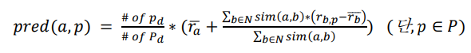

a : 타겟학생, p : 타겟 과목, d : 타겟 학생의 학과

\# of $p_d$ : d학과에서 p과목을 수강한 학생의 수, # of $P_d$ : d학과에서 수강한 전체 과목의 수 

d학과에서 타겟 p과목을 수강한 학생이 많을수록 더 높은 점수를 주도록 함.

# 4. 방법론

3에서 사용한 협업 필터링 방법론을 사용하여 추천시스템을 구성하면 일부 콜드 스타트 문제는 해결이 되어도 2가지 문제점이 발생함.

1. 협업 필터링은 모델이 아닌 알고리즘이기 때문에, 가중치가 저장or수정이 되지 않음. 즉 이 방법을 사용하기 위해서는 항상 처음부터 끝까지 알고리즘을 수행해야하고 결과물만 저장할 수 있음.  → 실시간으로 서비스를 제공할 수 없음을 의미함. 
2. 협업 필터링 방식은 [사용자, 아이템, 점수]의 데이터만을 사용가능 → 학생의 학과, 학년 등의 정보와 교수, 강의 유형등의 정보인 메타데이터를 사용할 수 없어짐. 

위 문제점을 해결하기 위해 CFMA 방법론을 제안 

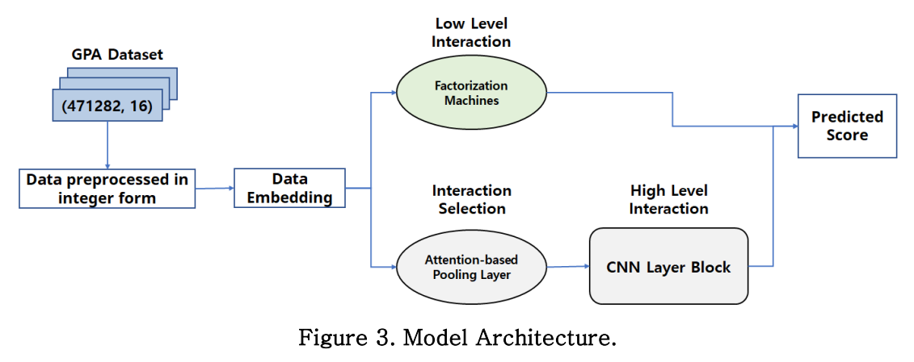

유저와 아이템의 정보가 포함되어 있는 메타데이터를 사용하고 이를 추천시스템에 활용하기 위해서 Convolutional Factorization Machines with Attention(CFMA) 방법론 제안. 

[CFMA의 프로세스]

1. 모든 텍스트 데이터를 컬럼 별로 정수 변환
2. 변환된 데이터를 임베딩
3. 임베딩된 벡터에 Factorization Machines 알고리즘 적용.
4. 동일하게 임베딩된 벡터에 Attention-based Pooling Layer기법 적용.
5. Attention이 적용되어 나온 값에 1D CNN Block 적용
6. 3에서 도출된 값과 5에서 도출된 값을 합하여 최종 값 도출

## 4-1. Embedding, Factorization Machine & Attention-based Pooling Layer

사용한 데이터 대부분이 텍스트 이므로 임베딩 과정이 필수적. 

but 자연어 처리분야의 임베딩과는 다르게 텍스트간의 관계가 없는 범주형 데이터이므로, word2vec과 같은 텍스트 임베딩 기법을 사용하지 않고 텍스트 데이터를 integer로 변환한 후, vector로 변환 하는 look up table을 통해 임베딩 진행.

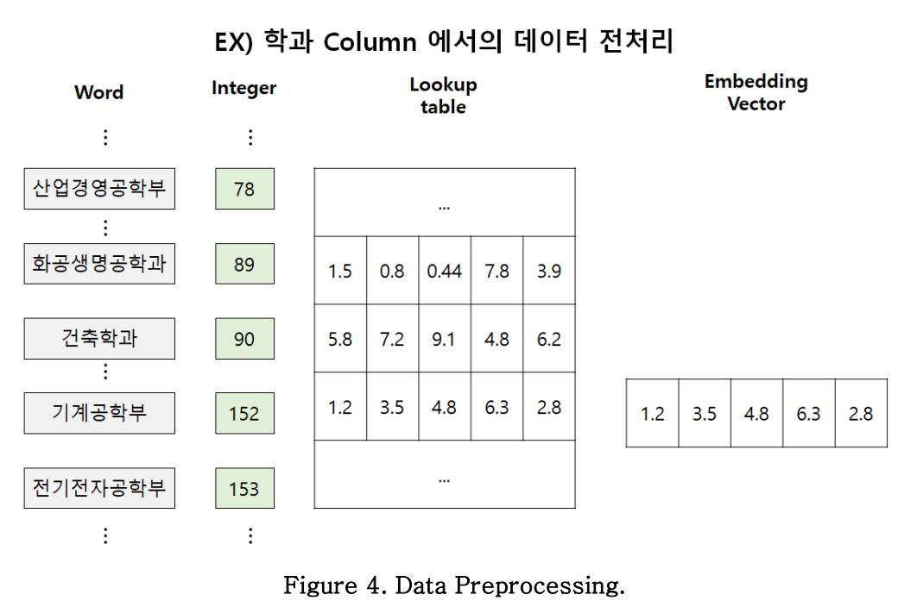

- **look up embedding**
    
    [09-07 파이토치(PyTorch)의 nn.Embedding()](https://wikidocs.net/64779)
    

Attentional Factorization Machine 에 대한 설명

→ [**Attentional Factorization Machine**][- **Attentional Factorization Machine**](#---attentional-factorization-machine)

## 4-2. Convolutional Neural Network Block

embedding 하고 attention score를 도출한 벡터에 1D Convolutional Layer 적용. 이를 통해 feature들 사이의 관계를 찾아내고자 하였으며, filter의 채널을 확장하여 표현력을 높이고자 함. 

filter는 Convolutional Layer를 한 번 통과할 때 마다 정해진 채널 수 만큼 filter의 개수가 늘어나며, 각 filter는 데이터를 설명해주는 특성을 찾아냄.

→ 여기서 이야기하는 channel 수 라는게 이해가 안됨.,,,ㅠㅠ

이때 filter의 크기과 stride를 통해 한 번에 얼마나 많은 양의 데이터를 확인할 것인지 얼마나 자주 확인할 것인지 결정할 수 있음. 

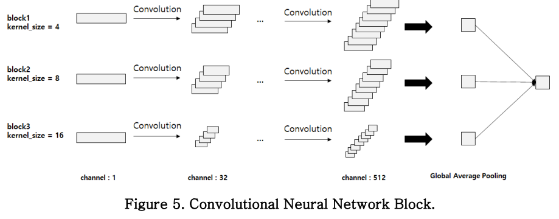

CNN block은 총 3개로 이루어져 있음. 각 block에서 filter 사이즈를 다르게 하여 각 block이 데이터를 다양하게 표현하도록 함. 

이 때, CNN block의 입력 값은 Attention based pooling layer의 출력 값임. 

1D CNN layer에서 filter의 채널과 사이즈는 사용자가 정의할 수 있지만, CNN 특성 상 layer를 거듭할수록 데이터의 크기가 작아지기 때문에 입력되는 Embedding 사이즈를 고려해야 함.
본 연구에서는 filter 크기를 [4,8,16], 채널을 [1,32,64,128,256, 512]로 하여 총 6번의 CNN layer를 적용시킴. 

이때 1D CNN Layer에는 Max Pooling Layer와 Batch Normalization Layer를 포함함. 3개의 block이 모두 진행을 마친 후 Global Average Pooling을 통해 각 1개의 값으로 요약함. 

이후 4-1에서 얻은 결과와 평균을 취하여 최종적으로 1개의 값을 도출함.

- **1D Convolutional Neural Network**
    
    [11-02 자연어 처리를 위한 1D CNN(1D Convolutional Neural Networks)](https://wikidocs.net/80437)
    
    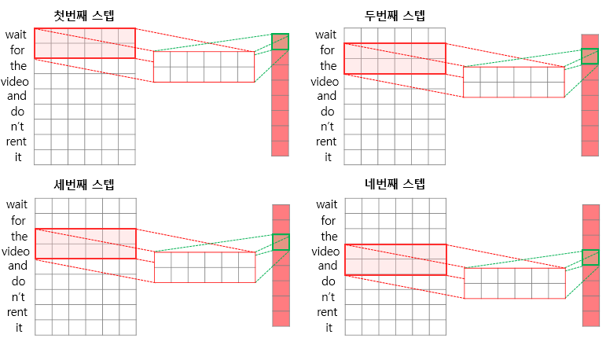
    
    1D convolutional Neural Network는 자연어 처리에서 사용됨. 이때 각 단어들은 임베딩 된 상태에서 filter를 적용함. 2D와 다르게 1D에 filter의 가로 크기는 단어들의 임베딩 차원으로 고정되어있고 세로 크기만 조정할 수 있음. 가로 크기가 임베딩 차원과 동일하여 filter가 오른쪽으로 이동할 수 없으므로 filter는 세로축으로만 이동함. 위 그림은 filter의 크기가 2일 때 4번째까지의 step을 표현한 그림임.
    

# 5. 데이터 구성

고려대 안암 캠퍼스에서 재학중인 대학생들이 실제로 강의를 수강한 후 진행되는 강의 평가에서 매긴 점수 데이터 사용. 학생이나 강의자의 개인정보는 암호화되어 가공된 데이터 사용. 강의 평가 데이터는 객관식으로 된 점수만 사용하였고, 이 점수는 1~6점까지의 척도로 되어 있음. 데이터에 포함되어있는 feature와 텍스트 데이터의 임베딩 사이즈는 다음 표를 따름.

데이터는 64:18:18 비율로 각각 train, validation, test set으로 나누어 사용함. 

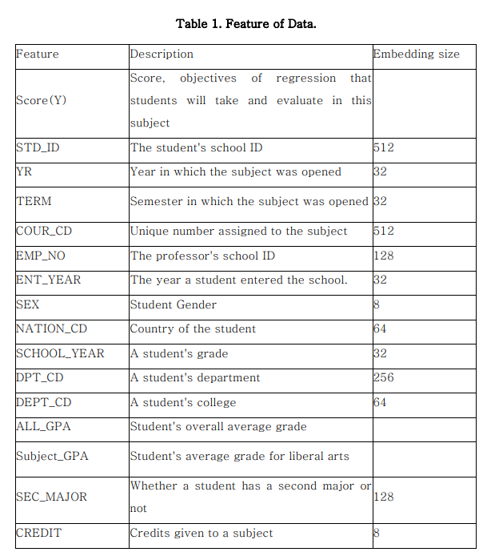

# 6. 실험 결과

이전에 연구되었던 다른 딥러닝 알고리즘과 CFMA 알고리즘 비교

평가방법은 MSE, MAE, MBE 사용 → 세 지표 모두 0에 가까울 수록 모델의 성능이 좋음. 

이전 연구인 협업 필터링을 활용한 연구의 경우 학과별 과목의 가중치를 곱하기 때문에 실제 값과의 차이가 매우 커 비교에 적합하지 않아 제외함.

[실험결과]

![Untitled(./image/paper15.png)

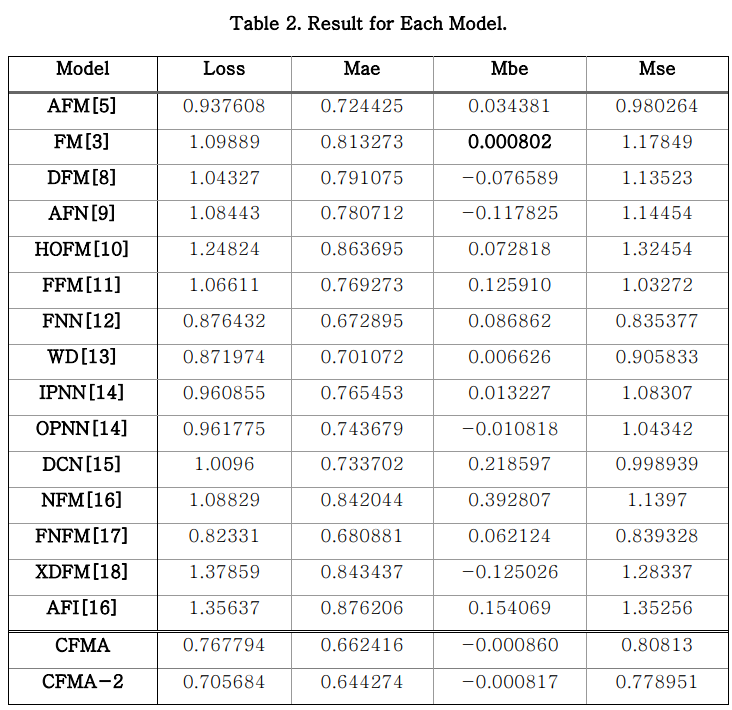

여기서 CFMA-2는 CFMA와 동일한 파라미터로 3000 epoch까지 진행하여 수렴하도록 학습한 결과임. 이전에 연구되었던 모델 중 상당수가 underfitting 현상을 보였는데, underfitting 현상을 보이지 않은 모델은 afm, fnn, nfm, cfma였음. 또한 CFMA가 가장 우수한 성능을 보여줌을 확인할 수 있음.

[실제 예측 예시]

협업 필터링 vs CFMA

두 방식으로 산업경영공학부 학생 두 명의 추천 강의 리스트를 작성.

협업 필터링 방식으로 추천하면 높은 학점을 받기에 유리한 과목이 두 학생에게 추천되었으나, CFMA를 이용하면 학생1에게는 언어관련 강의를, 학생2에게는 체육, 스포츠에 관련된 강의를 많이 추천하였음. 

# 7. 결론 및 활용방안

기존의 협업 필터링을 활용한 강의 추천 시스템의 경우 알고리즘을 기반으로 하기 때문에 실시간 서비스가 어려우며 콜드스타트 문제가 있었으나 CFMA 방식을 이용하여 해결할 수 있었음. 

또한 이를 통해 더 많은 정보를 활용하여 사용자들이 실시간으로 검색하는 정보들 또한 취합하여 추천시스템에 적용할 수 있었음.

더욱이 다른 연구들에 비해 underfitting 현상 없이 epoch이 증가할 수록 MSE값이 잘 수렴하고 있으며 성능이 가장 좋았음. 

이러한 장점은 개인화 추천 시스템이 발전하고 있는 현재 여러 환경에서 좋은 영향을 미칠 것이며, CFMA 알고리즘이 강의를 선택하는 학생들에게 편의성을 제공하고 더 높은 만족도를 줄 수 있기를 기대함.